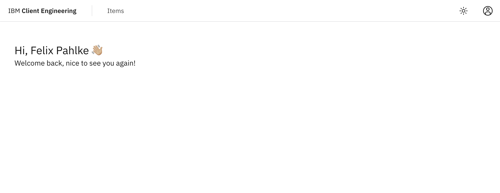
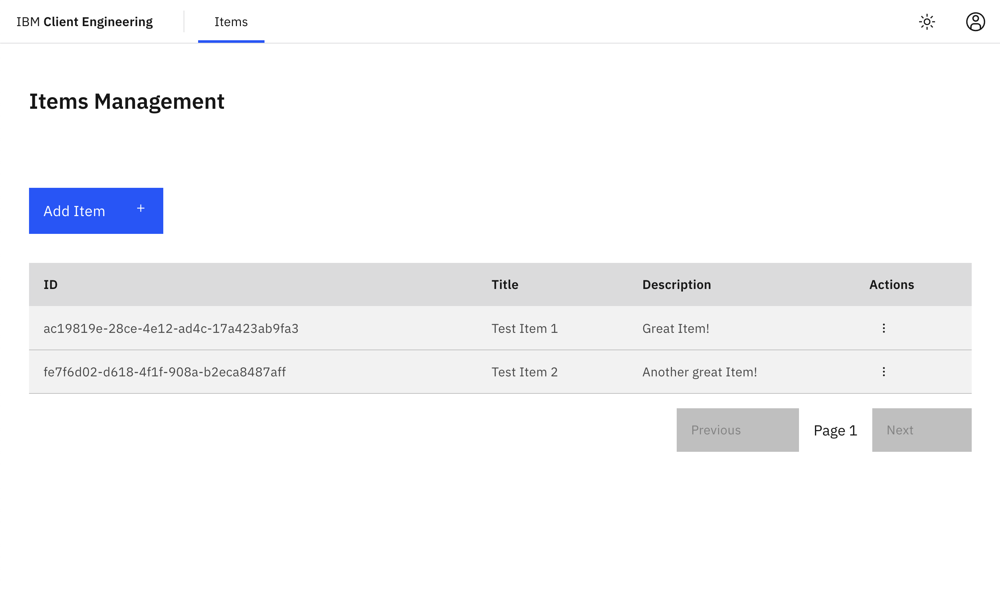
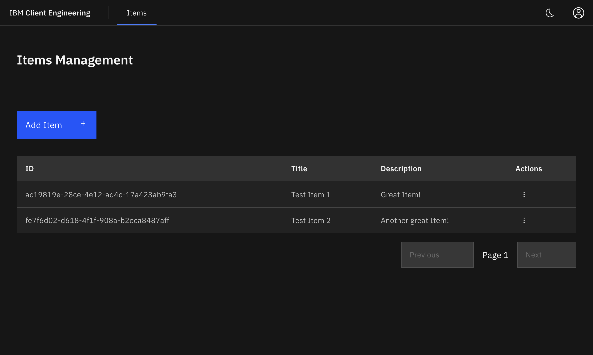

# Full Stack Client Engineering Template

## Technology Stack and Features

- ⚡ [**FastAPI**](https://fastapi.tiangolo.com) for the Python backend API.
  - 🧰 [SQLModel](https://sqlmodel.tiangolo.com) for database interactions on the flavours with relational persistence.
  - 🔍 [Pydantic](https://docs.pydantic.dev), used by FastAPI, for data validation and settings management.
  - 💾 [PostgreSQL](https://www.postgresql.org) on every database-backed flavour.
  - 📦 [uv](https://docs.astral.sh/uv/) for Python dependency management.
- 🚀 [React 19](https://react.dev) for the full-stack flavours' frontend.
  - 💃 TypeScript, [Vite](https://vite.dev), [TanStack Router](https://tanstack.com/router), and [TanStack Query](https://tanstack.com/query) form the modern frontend stack.
  - 🎨 [Carbon](https://carbondesignsystem.com/) or [shadcn/ui](https://ui.shadcn.com/), depending on the flavour, for frontend components.
  - 🤖 An automatically generated frontend client.
  - 🦇 Dark mode support.
- 🧹 [Biome](https://biomejs.dev/) for JavaScript and TypeScript linting and formatting.
- 🛠️ Native reload-enabled Uvicorn and Vite processes for development. [Docker Compose](https://www.docker.com) runs only the infrastructure a flavour needs: PostgreSQL and Adminer, plus Dex and oauth2-proxy on OAuth flavours. The stateless `backend-only-no-db` flavour needs no development containers.
- 🔒 Authentication via OAuth proxy with an IdP, in-app user management, or API key, depending on the flavour.
- 🚢 Deployment instructions for OpenShift and IBM Cloud Code Engine.

_This Template is based on [full-stack-fastapi-template](https://github.com/fastapi/full-stack-fastapi-template)_

## Flavours

This template is available in different flavours, which are represented by different branches, make sure to pull the correct branch for your use case:

| Branch | Auth | UI | Pros | Cons |
| --- | --- | --- | --- | --- |
| `oauth-proxy` | OAuth proxy with IdP | Carbon | Production-oriented SSO boundary | Requires an OIDC provider in production |
| `oauth-proxy-custom-ui` | OAuth proxy with IdP | shadcn/ui | Adaptable UI with a production-oriented SSO boundary | Requires an OIDC provider in production |
| `local-auth` | In-app user management | Carbon | Self-contained and easy to start | The application owns password and account security |
| `local-auth-custom-ui` | In-app user management | shadcn/ui | Adaptable UI and easy local startup | The application owns password and account security |
| `backend-only` | API key | — | Focused API with PostgreSQL persistence | No bundled frontend |
| `backend-only-no-db` | API key | — | Minimal stateless API with Docker-free development | No bundled frontend or persistence |

<br />

> The custom-ui flavours are easily adaptable to look like any customers UI, so choose those if Carbon is not the right fit.

> For full-stack applications, prefer the `oauth-proxy` flavours, unless you have a specific reason not to use them.

## Flavour: `oauth-proxy-custom-ui` — OAuth proxy with custom UI

This branch provides FastAPI/PostgreSQL, a React 19 frontend using shadcn/ui, and an
oauth2-proxy authentication boundary. Development uses local Dex and oauth2-proxy containers,
native Uvicorn/Vite, and Compose-hosted PostgreSQL/Adminer. Production keeps separate backend and
nginx frontend images plus the proxy.

### Quick start

Prerequisites: Node.js 20.19 or newer with npm, Python 3.10–3.12, uv, and a running
container runtime. Supported choices are Docker Desktop, Rancher Desktop with the dockerd/moby
backend, native Linux Docker, and Podman. Docker requires the Compose plugin or standalone
`docker-compose`; Podman requires `podman compose` with a provider (`podman-compose` or standalone
`docker-compose`), or the `podman-compose` command. Start `podman machine` first where required.

```bash
npm ci
npm ci --prefix frontend
uv sync --project backend
cp .env.example .env
npm run dev
```

Enter through the proxy at `http://localhost:4180`, never the direct Vite port. The local Dex
login uses `DEX_TEST_USER_EMAIL` and `DEX_TEST_USER_PASSWORD` from `.env`. The API is bound to
`127.0.0.1:8000`; Vite is at `http://localhost:5173`, Dex at
`http://localhost:5556/dex`, and Adminer at `http://localhost:8080`.

`npm run dev` generates strong per-checkout local proxy secrets when marker values are present,
starts PostgreSQL/Adminer/Dex/oauth2-proxy in Compose, and starts Uvicorn/Vite natively. Ctrl-C
stops native children and removes development containers; worst case is about 12 seconds. A
second Ctrl-C escalates immediately. Database data is preserved.

Dex is the zero-configuration default. For AppID, Keycloak, or another external OIDC provider,
set `OAUTH2_PROXY_OIDC_ISSUER_URL` and its client credentials in `.env`; the optional redirect,
well-known, and cookie-domain keys are documented in
[the development guide](.docs/development.md#bundled-dex-or-an-external-idp). No Compose edit is
required.

### Root commands

| Command | Purpose |
| --- | --- |
| `npm run dev` | Start backing/auth services and native backend/frontend processes |
| `npm run check` / `npm run fix` | Check or fix generated, frontend, and backend sources |
| `npm run test` | Run supervisor, deployment-mock, and hermetic backend tests |
| `npm run build` | Build the production frontend bundle |
| `npm run verify` | Run `check`, `test`, and `build` |
| `npm run db:migrate` / `npm run db:revision -- -m "message"` | Manage Alembic revisions |
| `npm run test:deploy` | Run Code Engine/OpenShift mocks and OAuth deployment assertions |
| `npm run test:e2e:container` | Run the real Dex/proxy Playwright flow in a matching container |
| `npm run generate-client` | Regenerate OpenAPI, client, and routes |

### OAuth behavior

Browser sign-in starts at `/oauth2/sign_in`; the proxy establishes the session and passes a
normalized identity to the backend through a private Basic credential. Browser-supplied identity
headers or bearer tokens are not trusted. `/oauth2/sign_out` ends the proxy session, but it does
**not** end the upstream identity provider's SSO session. A subsequent login can therefore be
silent until the IdP session itself expires or is ended at the IdP.

## Sample Applications & Tutorials

Check out our Collection of Sample Applications (AI-Chat, Agents, RAG, etc.) built on top of the template:

- [Client Engineering DACH 🚀](https://github.ibm.com/client-engineering-dach/)
- [Tutorials](https://github.ibm.com/client-engineering-dach/full-stack-cen-template-tutorials)

## AI-Assisted Development

This project includes an [AGENTS.md](./AGENTS.md) file that provides comprehensive guidelines for agentic AI assistants like [**Bob**](https://www.ibm.com/products/bob) to autonomously implement new features. The file contains:

- 📋 Project structure and conventions
- 🔧 Backend and frontend development rules
- 🚀 Essential workflows for common tasks
- ⚠️ Common mistakes to avoid

These guidelines enable AI assistants to understand the codebase and its conventions which leads to more robust and consistent code.

> **NOTE:** You can customize or delete the AGENTS.md file to influence the behavior of your coding assistant.

## Screenshots

The application screenshots show the full-stack frontend flavours; the backend-only flavours do not include a frontend.

### Dashboard



### Items



### Dark Mode



### Interactive API Documentation


## How to Use It

### Setup with [create-cen-app](https://github.com/felixpahlke/create-cen-app) and choose "full-stack-cen-template"

```bash
npm create cen-app@latest
```

### Or clone manually (commands may vary by flavour - check the specific branch):

- Clone this repository manually, set the name with the name of the project you want to use, for example `my-full-stack`:

```bash
git clone -b oauth-proxy-custom-ui git@github.ibm.com:client-engineering-dach/full-stack-cen-template.git my-full-stack
```

- Enter into the new directory:

```bash
cd my-full-stack
```

- Set the new origin to your new repository (copy from GitHub interface):

```bash
git remote set-url origin git@github.ibm.com:my-username/my-full-stack.git
```

- Add the template repository as upstream to get future updates:

```bash
git remote add upstream git@github.ibm.com:client-engineering-dach/full-stack-cen-template.git
```

- Rename the branch if your new repository should use a different branch name:

```bash
git branch -m my-template-branch
```

- Push the code to your new repository:

```bash
git push -u origin my-template-branch
```

## Update From the Original Template

After cloning the repository, and after doing changes, you might want to get the latest changes from this original template.

- Make sure you added the original repository as a remote, you can check it with:

```bash
git remote -v

origin    git@github.ibm.com:my-username/my-full-stack.git (fetch)
origin    git@github.ibm.com:my-username/my-full-stack.git (push)
upstream    git@github.ibm.com:client-engineering-dach/full-stack-cen-template.git (fetch)
upstream    git@github.ibm.com:client-engineering-dach/full-stack-cen-template.git (push)
```

- Pull the latest changes without merging (commands may vary by flavour - check the specific branch):

```bash
git pull --no-commit upstream oauth-proxy-custom-ui
```

This will download the latest changes from this template without committing them, that way you can check everything is right before committing.

- If there are conflicts, solve them in your editor.

- Once you are done, commit the changes:

```bash
git merge --continue
```

## Development

General development docs: [development.md](./.docs/development.md).

Consumer migration guidance: [migration-guide.md](./.docs/migration-guide.md).

## Deployment

OpenShift Deployment docs: [oc-deployment.md](./.docs/oc-deployment.md).

Code Engine Deployment docs: [ce-deployment.md](./.docs/ce-deployment.md).

## Backend Development

Backend docs: [backend/README.md](./backend/README.md).

## Frontend Development

Frontend docs, including generated code and the Playwright container flow: [frontend/README.md](./frontend/README.md).

## Release Notes

Check the file [release-notes.md](./.docs/release-notes.md) and the [changelog](./CHANGELOG.md).
